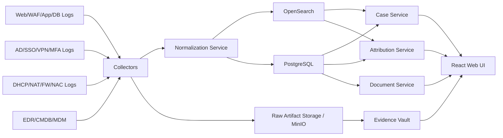

# System Architecture

## 1. 목표 아키텍처

이 시스템은 아래 6개 레이어로 구성한다.

1. **Ingestion Layer**: 소스별 로그 수집
2. **Normalization Layer**: Canonical Event 변환
3. **Correlation & Attribution Layer**: IP/계정/단말 상관분석
4. **Case & Evidence Layer**: 사건/증거/문서/승인 관리
5. **Search & Analytics Layer**: 빠른 조회와 타임라인
6. **UI & Governance Layer**: 조사자 화면, 법무/감사 기능

## 2. 논리 아키텍처

## 3. 권장 구현 구성

### 3.1 Frontend
- React + TypeScript + Vite
- React Query
- Router 기반 SPA
- 서버 상태와 로컬 UI 상태 분리
- 기본 테이블/필터/타임라인/패널 UI 제공

### 3.2 Backend API
- FastAPI
- SQLAlchemy 2.x
- Pydantic v2
- Alembic
- JWT/OIDC 연동 가능한 인증 미들웨어
- RBAC 정책 계층

### 3.3 Search/Correlation
- OpenSearch index for normalized events
- 시간 범위, IP, hostname, username, path, session 기준 검색
- 사건 상세에서는 Postgres 정본 + OpenSearch 질의 결과를 조합

### 3.4 Evidence Vault
- MinIO(S3 compatible)
- Raw artifacts, exported bundles, generated documents 저장
- Object lock 또는 불변 보관 옵션 전제
- 저장 시 SHA-256 체크섬 기록

## 4. 서비스 경계

### 4.1 Ingestion Service
책임:
- 로그 파일/HTTP/syslog/agent 입력 수용
- 소스별 parser dispatch
- raw artifact 저장
- 정규화 이벤트 생성

비책임:
- 사건 판정
- 문서 승인

### 4.2 Attribution Service
책임:
- IP -> 단말 -> 계정 -> 사용자 연결
- 귀속 신뢰도 계산
- 내부/외부 분기
- 귀속 근거 JSON 생성

비책임:
- 원본 이벤트 저장 정본 관리

### 4.3 Case Service
책임:
- 사건 생성, 상태 전이, 태그, 담당자, 메모
- 사건과 이벤트/증거 연결
- 사건 요약 생성용 snapshot 확정

### 4.4 Evidence Service
책임:
- 사건별 freeze
- 증거 해시 관리
- export bundle 생성
- 문서/원본 연결

### 4.5 Document Service
책임:
- 템플릿 기반 사건 요약서/증거목록/고소장 초안 렌더링
- 입력 snapshot 저장
- 승인 상태 관리

## 5. 데이터 흐름

### 5.1 Ingestion Flow
1. connector가 raw input 수집
2. raw artifact를 MinIO에 저장
3. raw artifact 해시 계산
4. parser가 Canonical Event 생성
5. Canonical Event를 OpenSearch + PostgreSQL에 기록
6. 필요 시 rule engine이 alert 생성

### 5.2 Investigation Flow
1. 조사자가 IP/계정/자산/도메인 검색
2. API가 OpenSearch에서 관련 이벤트 조회
3. Case Service가 사건 후보/기존 사건과 매칭
4. Attribution Service가 귀속 후보 계산
5. UI가 타임라인, 엔티티 그래프, 귀속 근거 출력

### 5.3 Evidence Freeze Flow
1. 조사자가 사건에서 freeze 실행
2. 시스템이 관련 raw artifact와 normalized event snapshot을 잠금
3. checksum과 manifest 생성
4. export용 bundle 메타데이터 저장

### 5.4 Document Generation Flow
1. 사건 상태가 Review 가능 수준이 되면 snapshot 생성
2. snapshot과 템플릿으로 문서 렌더링
3. 생성물 checksum 기록
4. 승인 전까지 DRAFT 상태 유지

## 6. 배포 형태

### 6.1 개발/로컬
- Docker Compose
- postgres
- opensearch
- minio
- redis
- api
- web

### 6.2 운영/확장
- Kubernetes 또는 VM 분리 가능
- Search cluster 별도 확장
- Object storage 별도 보강
- 백엔드 stateless 확장 가능 구조

## 7. 보안 아키텍처

- 내부 인증은 OIDC/SAML 연동 권장
- 역할 기반 접근제어 필수
- 증거/문서 열람은 별도 권한 분리
- 모든 민감조회는 감사로그 기록
- 시크릿은 환경변수 직주입 대신 secret store 권장
- DB, Search, Storage 간 TLS 가능 구조 권장

## 8. 시간 처리 원칙

- 시스템 내부 저장: UTC
- UI 표시: KST 병기
- 외부 로그 파싱 시 timezone 누락 이벤트는 소스별 규칙으로 보정
- time drift 관측값을 ingestion diagnostics에 저장

## 9. 관측성과 운영지표

- source ingest lag
- parser success/failure rate
- index latency
- case creation volume
- freeze duration
- document generation duration
- audit log write failure rate

## 10. 구현 메모

- PostgreSQL은 **정본**으로 사용
- OpenSearch는 검색/분석 최적화용 보조 저장소로 사용
- 문서 생성 입력값은 항상 JSON snapshot으로 영구 보관
- 귀속 판단 결과는 계산 결과이므로 재계산 가능하도록 근거 데이터와 분리 저장
