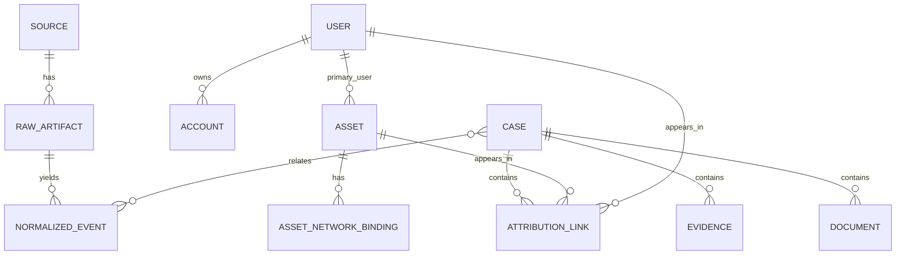

# Data Model

## 1. 모델링 원칙

1. 원본 로그(raw artifact)는 수정 불가 객체로 저장한다.
2. Canonical Event는 raw artifact를 참조한다.
3. 사건(Case)은 여러 이벤트/증거/문서를 묶는 조사 단위다.
4. 귀속 결과는 사실 자체가 아니라 **증거에 기반한 계산 결과**로 저장한다.
5. 문서 생성 입력 snapshot은 문서와 1:1 버전 관계를 가진다.

## 2. 핵심 엔티티

### 2.1 Source
로그 소스 정의
- 예: nginx-prod, vpn-radius, ad-auth, edr-crowdstrike, cmdb-main

필수 필드:
- id
- name
- source_type
- enabled
- parser_name
- config_json

### 2.2 RawArtifact
수집된 원본 로그 단위(파일, 배치, API payload)
- object_uri
- sha256
- collected_at
- parser_version
- source_id

### 2.3 NormalizedEvent
정규화 이벤트
- event_time
- event_type
- src_ip / dst_ip
- hostname
- username
- session_id
- request_host / request_path
- status_code
- bytes_sent
- source_id
- raw_artifact_id
- payload_json

### 2.4 Asset
자산/단말 정보
- asset_tag
- hostname
- serial_number
- device_type
- owner_user_id
- primary_user_id
- status
- metadata_json

### 2.5 User
내부 사용자
- employee_no
- username
- display_name
- email
- department
- status

### 2.6 Account
사용자와 인증 계정 연결
- user_id
- provider (AD, SSO, VPN, LOCAL)
- account_name
- external_id

### 2.7 AssetNetworkBinding
특정 시점의 IP/MAC/포트/SSID와 자산 연결
- asset_id
- ip
- macaddr
- switch_port
- ssid
- lease_start
- lease_end

### 2.8 Case
조사 단위
- case_no
- title
- status
- severity
- primary_ip
- primary_asset_id
- primary_user_id
- external_actor_label
- confidence_grade
- summary

### 2.9 AttributionLink
귀속 계산 결과
- case_id
- observed_ip
- asset_id
- user_id
- account_id
- confidence_score
- grade
- rationale
- evidence_json

### 2.10 Evidence
증거 항목
- case_id
- evidence_type
- raw_artifact_id / normalized_event_id
- object_uri
- sha256
- status
- frozen_at
- exported_at

### 2.11 Document
자동 생성 문서
- case_id
- doc_type
- status
- version_no
- storage_uri
- checksum_sha256
- generated_from_json
- reviewed_by
- approved_at

### 2.12 AuditLog
감사로그
- actor
- action
- entity_type
- entity_id
- before_json
- after_json
- created_at

## 3. Canonical Event 스키마

최소 스키마:

```json
{
  "event_time": "2026-03-15T03:11:20Z",
  "source_type": "WAF",
  "event_type": "http_request",
  "src_ip": "203.0.113.10",
  "dst_ip": "10.0.2.15",
  "hostname": "api-prod-02",
  "username": null,
  "session_id": "sess_123",
  "request_method": "GET",
  "request_host": "api.example.com",
  "request_path": "/admin/export",
  "status_code": 403,
  "bytes_sent": 512,
  "raw_artifact_id": "uuid",
  "payload": {
    "user_agent": "Mozilla/5.0",
    "rule_name": "admin_path_access"
  }
}
```

## 4. 관계도



## 5. 귀속 근거 JSON 예시

```json
{
  "observed_ip": "10.10.34.25",
  "candidate_asset": {
    "asset_tag": "LAP-00429",
    "hostname": "WS-SEOUL-429"
  },
  "candidate_user": {
    "username": "jkim",
    "display_name": "김지훈"
  },
  "evidence": [
    {
      "type": "DHCP_LEASE",
      "matched": true,
      "weight": 0.35,
      "details": "2026-03-15T02:55:00Z ~ 2026-03-15T06:55:00Z"
    },
    {
      "type": "EDR_HOST_MATCH",
      "matched": true,
      "weight": 0.35,
      "details": "hostname WS-SEOUL-429 / serial SN123"
    },
    {
      "type": "AD_LOGIN",
      "matched": true,
      "weight": 0.30,
      "details": "jkim logged in at 2026-03-15T03:02:11Z"
    }
  ],
  "confidence_score": 0.93,
  "grade": "A"
}
```

## 6. 보관/인덱싱 전략

### PostgreSQL
정본 저장:
- cases
- evidence
- documents
- audit_logs
- assets
- users
- accounts
- attribution_links
- normalized_events(핵심 메타데이터)

### OpenSearch
질의 최적화:
- normalized_events full-text + faceting
- time-based indices
- IP/path/status/session/hostname/username 색인

### MinIO
객체 저장:
- raw artifacts
- frozen bundles
- exported zip
- generated documents

## 7. 인덱스 권장사항

### PostgreSQL
- `normalized_events(event_time desc)`
- `normalized_events(src_ip, event_time desc)`
- `normalized_events(username, event_time desc)`
- `asset_network_bindings(ip, lease_start, lease_end)`
- `cases(case_no unique)`
- `audit_logs(entity_type, entity_id, created_at desc)`

### OpenSearch
- `event_time`
- `src_ip`
- `hostname`
- `username`
- `session_id`
- `request_host`
- `request_path`
- `status_code`
- `rule_name`

## 8. 삭제/정정 원칙

- raw artifact는 삭제보다 접근제한 우선
- normalized event는 소스 오류가 있어도 원문 연계 유지
- 문서 수정은 덮어쓰기 대신 새 버전 생성
- 귀속 결과는 재계산 가능하도록 version/engine metadata 보관

## 9. 샘플 사건 요약 Snapshot 스키마

```json
{
  "case_no": "INC-2026-000123",
  "title": "외부 IP의 관리자 경로 반복 접근",
  "opened_at": "2026-03-15T04:00:00Z",
  "primary_ip": "203.0.113.10",
  "actor": {
    "type": "EXTERNAL_UNKNOWN",
    "display_name": "성명불상",
    "confidence_grade": "D"
  },
  "affected_services": ["api.example.com", "admin.example.com"],
  "facts": [
    "10분 동안 /admin 계열 요청 214건",
    "403/404 비율 88%",
    "WAF 규칙 admin_path_access 12회 일치"
  ],
  "evidence_ids": ["uuid1", "uuid2", "uuid3"]
}
```
