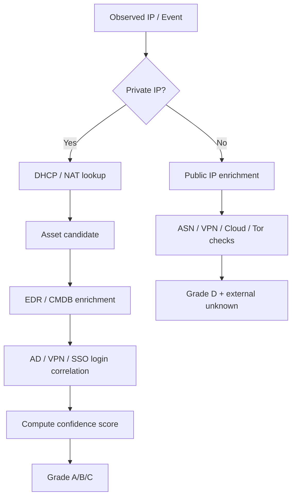

# Detection & Attribution Design

## 1. 목적

이 문서는 이상행위 탐지(rule-based detection)와 내부 귀속(attribution)의 설계 원칙을 정의한다.

핵심은 두 가지다.

1. **탐지**: 어떤 행위가 사건화되어야 하는가
2. **귀속**: 그 행위가 어떤 단말/계정/사용자와 연결되는가

## 2. 탐지 범주

### 2.1 웹/도메인 이상 요청
- 관리자/백오피스/숨김 경로 반복 접근
- 짧은 시간 내 URL 다건 순회
- 401/403/404 비율 급증
- 비정상 쿼리 패턴
- 다운로드/내보내기 엔드포인트 접근

### 2.2 계정/인증 이상
- 다계정 로그인 실패
- 비업무시간 인증 성공 + 민감행위 조합
- MFA 실패 후 성공 반복
- 비정상 지역/경로의 접속

### 2.3 데이터 접근 이상
- 평소보다 큰 조회량
- 대량 다운로드/내보내기
- 권한변경 직후 조회/다운로드
- 민감 테이블/관리자 기능 접근

### 2.4 단말/네트워크 이상
- 동일 사용자의 다중 단말 동시 행위
- Jump/VDI 환경의 비정상 세션
- 사내 IP인데 자산 매핑 실패
- 퇴사/비활성 사용자와 연계된 인증 흔적

## 3. 룰 설계 원칙

- 룰은 설명 가능해야 한다.
- 룰은 근거 이벤트 ID를 남겨야 한다.
- 룰은 탐지 score와 severity를 분리해야 한다.
- 룰은 버전 관리되어야 한다.
- 고위험 룰만 자동 사건 후보 생성 대상으로 삼는다.

## 4. 예시 룰

### Rule R-001: Admin Path Access Burst
조건:
- 10분 내 `/admin`, `/manage`, `/export`, `/backup` 계열 경로 30회 이상
- 403 또는 404 비율 70% 이상

결과:
- severity = high
- score = 85
- evidence = matching request events

### Rule R-002: Mass Download After Role Change
조건:
- 권한변경 이벤트 후 30분 내 다운로드량 급증
- 평소 대비 10배 이상

결과:
- severity = critical
- score = 95

### Rule R-003: Internal IP With Unmapped Asset
조건:
- 사설 IP 대역 요청
- DHCP/NAT/EDR/CMDB 매핑 실패

결과:
- severity = medium
- score = 60
- triage required

## 5. 귀속 엔진 입력

귀속 엔진은 아래 증거를 이용한다.

- DHCP lease
- NAT binding
- Firewall session
- VPN login
- AD/SSO login
- EDR host metadata
- CMDB asset ownership
- Jump server/VDI session
- Wi-Fi/NAC association(선택)

## 6. 귀속 계산 흐름

## 7. 귀속 점수화 예시

### 7.1 가중치 예시
- DHCP lease match: 0.30
- NAT/session match: 0.15
- EDR hostname/serial match: 0.25
- AD login within time window: 0.20
- VPN login match: 0.10

### 7.2 등급 기준 예시
- 0.85 이상: A
- 0.70 이상: B
- 0.40 이상: C
- 0.39 이하: D 또는 insufficient

## 8. 내부 vs 외부 처리 차이

### 내부
- 사용자 실명 후보를 보여줄 수 있다.
- 단, A/B 등급에서만 자동 문서 반영 허용
- C 등급은 후보 리스트만 표기

### 외부
- 이름 대신 `성명불상`
- 사업자/클라우드/프록시/VPN 여부만 표시
- 다음 단계에 `통신사/플랫폼/수사기관 조회 필요` 표기
- 실명 자동기입 금지

## 9. 사건 표시 규칙

사건 화면에 반드시 표시:

- 관측 IP
- 내부/외부 구분
- 귀속 등급
- 귀속 근거 수
- 귀속 불확실성 사유
- 다음 권장 조치

## 10. 품질 측정

- 귀속 A/B의 사후 검증 정확도
- C/D의 재분류율
- 규칙별 오탐률/정탐률
- 사건화까지 걸린 시간
- 문서 생성 후 보정률

## 11. 향후 확장

- 행동 기반 프로파일링
- 베이스라인 편차 탐지
- ML-assisted ranking (단, 설명 가능성 유지)
- 룰 시뮬레이터
